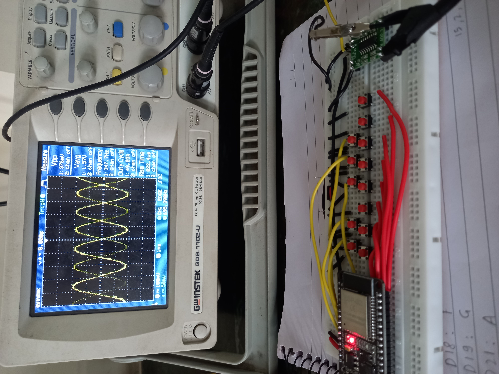
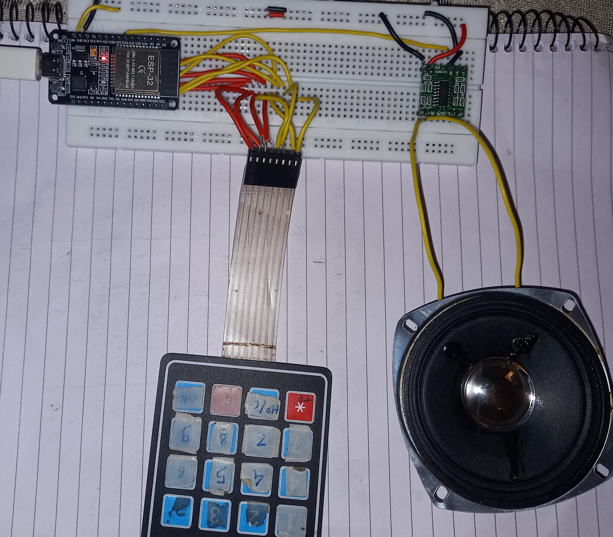
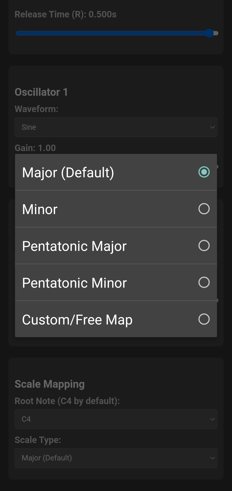
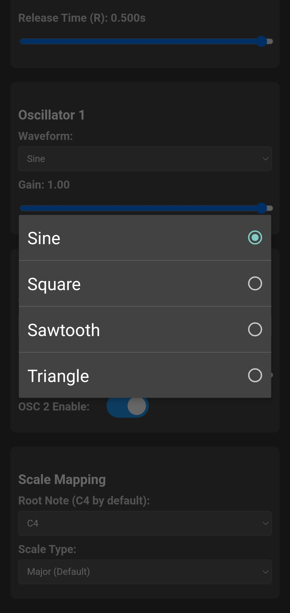
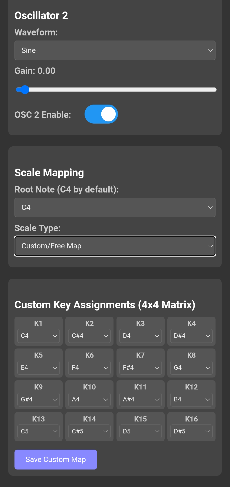

# 🎹 ESP32-Synth: Polyphonic Synthesizer with Web Control

## 🌟 Overview

The **ESP32-Synth** is a 16-key polyphonic digital synthesizer built on the ESP32 microcontroller. It leverages the chip's dual-core architecture to ensure reliable, low-latency audio generation while simultaneously managing keypad input and a comprehensive Wi-Fi Web UI for sound design.

This project demonstrates real-time audio synthesis using I2S with the built-in 8-bit DAC, software-level noise mitigation, and concurrent programming (FreeRTOS).

---

## ✨ Key Features

* **Polyphonic Engine:** Supports up to **16 simultaneous voices** (one per key) with dedicated voices for true polyphony.
* **Dual Oscillators (DCO):** Two oscillators per voice (`OSC1` and `OSC2`) with independent gain mixing.
* **Waveforms:** Features four classic waveforms: **Sine, Square, Sawtooth, and Triangle**.
* **ADSR Envelope:** Full Attack, Decay, Sustain, and Release control, applied per voice for expressive shaping.
* **16-Key Matrix Input:** Hardware interface using a $4 \times 4$ matrix keypad with robust software debouncing.
* **Wi-Fi Web UI:** Provides a full control interface over Wi-Fi AP for adjusting waveforms, gains, ADSR times, and musical scales.
* **I2S DAC Output:** Audio output via the ESP32's internal 8-bit DAC pins (GPIO 25/26), driven by the I2S peripheral.
* **Noise Reduction:** Includes software **dithering** and scaling to significantly reduce the harsh quantization clicking noise inherent to 8-bit DAC output.

---

## 🛠️ Hardware Requirements

To replicate this project, you will need:

| Component | Quantity | Notes |
| :--- | :--- | :--- |
| **ESP32 Dev Board** | 1 | Any standard ESP32 model (WROOM, etc.). |
| **4x4 Matrix Keypad** | 1 | Used for musical input. |
| **Audio Output** | 1 | Simple speaker/headphones connected via an amplifier to DAC pins. |

### 📌 Pinout Reference

As defined in `Control.h` and the I2S configuration:

| Function | Pin(s) | Notes |
| :--- | :--- | :--- |
| **Keypad Rows** | `15, 2, 4, 5` | Output drivers. |
| **Keypad Columns** | `18, 19, 21, 22` | Input with PULLUP. |
| **I2S DAC Out (Left)** | `GPIO 25` | Audio signal output. |
| **I2S DAC Out (Right)**| `GPIO 26` | Audio signal output. |

---

## ⚙️ Software Architecture

The system utilizes FreeRTOS to guarantee real-time audio performance, isolating critical functions onto separate CPU cores:

| Core | Task | Description |
| :--- | :--- | :--- |
| **Core 1** | `AudioTask` | **Real-Time Synthesis:** Runs the `Synth::audioGeneratorLoop()`. It handles sample mixing (16 voices), envelope processing, and continuous I2S buffer writing. Pinned at high priority. |
| **Core 0** | `loop()` | **Control/UI:** Manages keypad scanning, debouncing, note ON/OFF events, and all Wi-Fi Web Server client requests. |

### Key Files:

* **`Synth.h` / `Synth.cpp`:** Contains the digital signal processing (DSP) logic, including `Oscillator`, `Envelope`, and the **`Voice`** classes that enable polyphony.
* **`Control.h` / `Control.cpp`:** Handles hardware input, specifically the $4 \times 4$ matrix keypad scan and software debouncing.
* **`UI.h` / `HTML_Content.h`:** Manages the Wi-Fi Access Point setup and serves the custom HTML interface for remote control.

---

## 🚀 Getting Started

### 1. Setup and Upload

1.  Ensure you have the **ESP32 Board Manager** and the **`WebServer`** library installed in your Arduino environment.
2.  Wire the hardware as specified in the Pinout table above.
3.  Open `ESP32_Synth.ino` in the Arduino IDE (all files must be in the same folder).
4.  Upload the code to your ESP32 board.

### 2. Wi-Fi Control

1.  After booting, the ESP32 creates a Wi-Fi Access Point. Check the Serial Monitor for the IP address.
2.  Connect a device (phone, laptop) to the network:
    * **SSID:** `APSIT_SYNTH`
    * **Password:** `12345678`
3.  Open a web browser and navigate to the assigned IP address (e.g., `192.168.4.1`).
4.  You can now control the synth parameters (Waveforms, Gain, ADSR) from the Web UI while playing notes on the physical keypad.

### 3. Playing Notes

* Press and hold keys on the $4 \times 4$ matrix keypad. Due to the polyphonic engine, you can press up to 16 keys simultaneously.

---

## 💡 Note on Noise Mitigation

The audio output relies on the ESP32's built-in 8-bit DAC. The **mids-frequency clicking** you might hear is caused by coarse **quantization error** during the 16-bit to 8-bit sample conversion.

The implemented solution is a form of **dithering**:
1.  The mixed polyphonic 16-bit sample is heavily scaled down to ensure headroom (prevent clipping).
2.  A small pseudo-random noise value is added to the sample **before** the final 8-bit quantization.

This technique converts the harsh, noticeable digital clicking into a much softer, continuous background **hiss** or **white noise**, which is far less disruptive to the musical sound.

Implementation:

